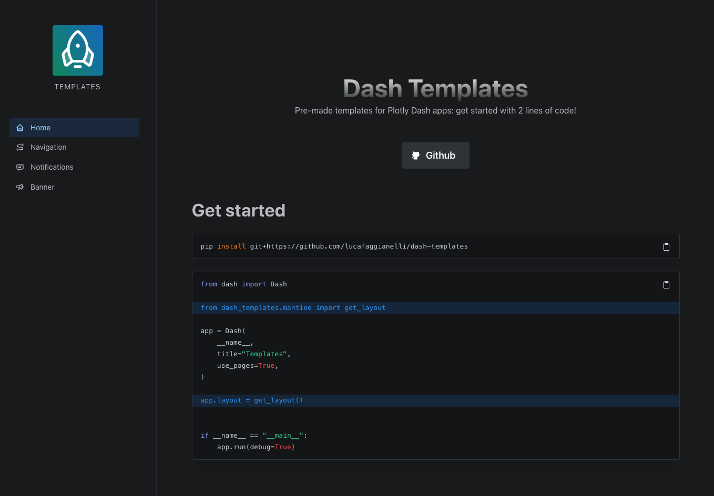

# Dash Templates

Pre-made templates for Plotly Dash apps: get started with 2 lines of code!




## Get started


```sh
pip install git+https://github.com/lucafaggianelli/dash-templates
```

> For the moment only a Mantine template is available:
  more templates to come!

```py
from dash import Dash

from dash_templates.mantine import get_layout

app = Dash(
    __name__,
    title="My app",
    use_pages=True,
)

app.layout = get_layout()


if __name__ == "__main__":
    app.run(debug=True)
```